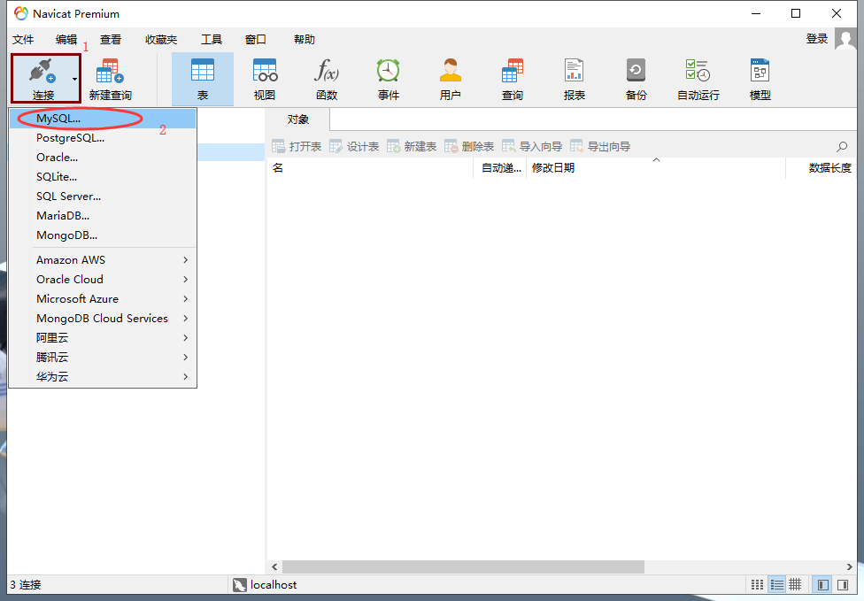
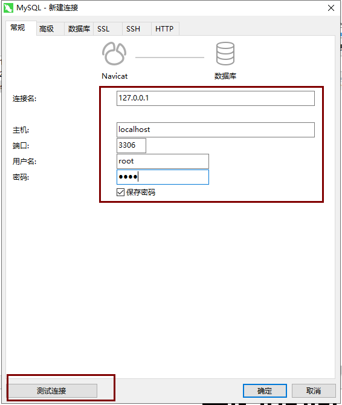
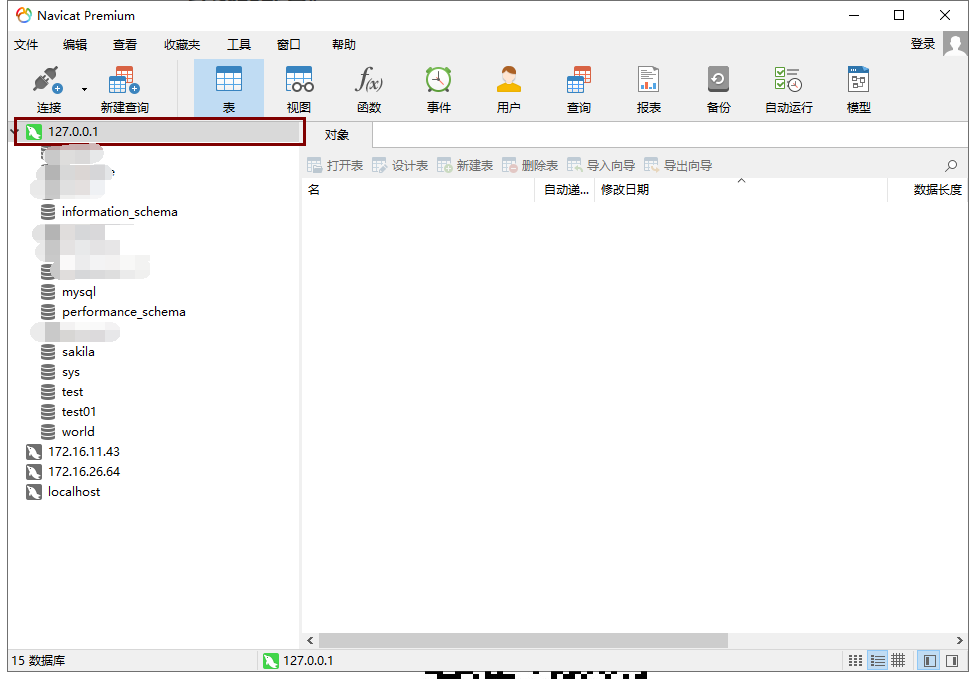
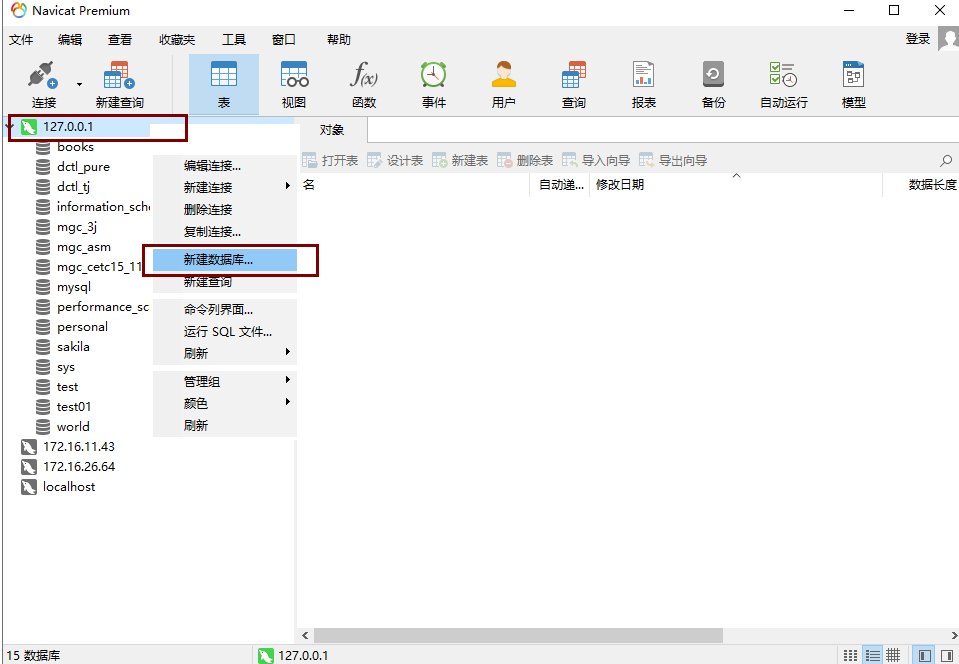
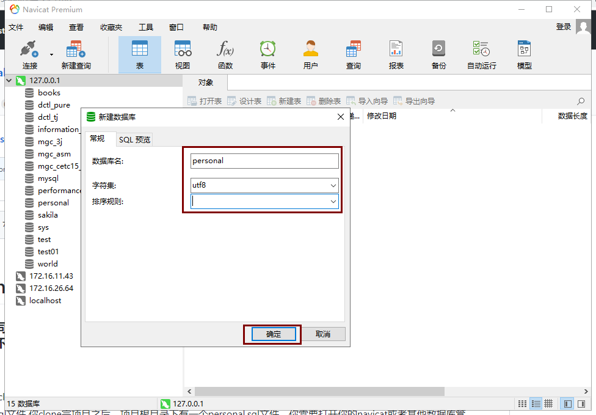
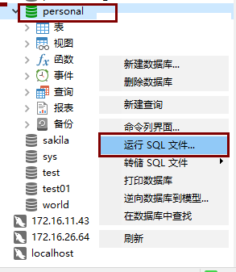
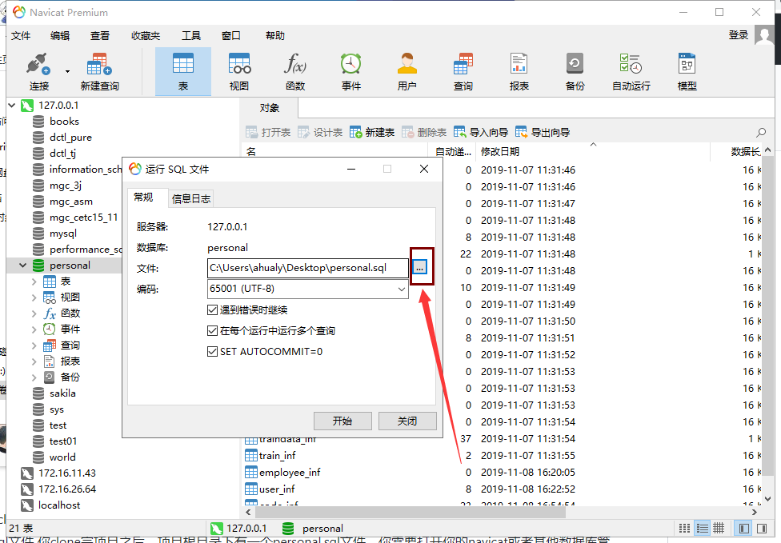
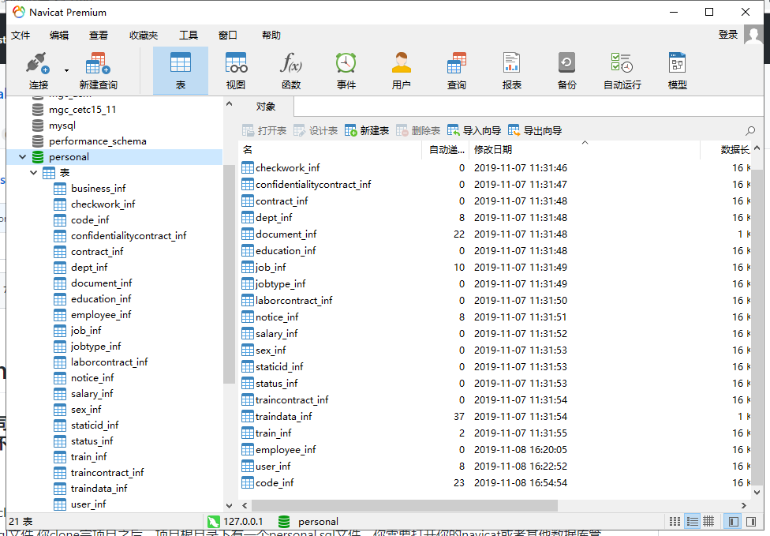

# Personal
### 鉴于很多同学在部署的时候出现了很多问题，我现在做一个教程，你们按照这个教程来部署运行项目，应该不会有太多的问题，这里介绍Eclipse环境的部署。
### 切忌不要直接导入，切忌切忌，最不推荐的，好多同学为了方便省事，以为项目直接导入就能运行，有时候数据库都没安装，环境都没配置好，database.properties文件中的数据库用户名密码都没修改，或者jar的依赖都没有正确引入，一旦出现问题，各种爆红，就不知所措，截图一张扔到群里，这样是很不好的，别人看了有时候也会很懵，你按照正确的步骤操作，一般不会有太多的问题，因为项目都是保证能够正确运行才push到github的，项目本身不会有太大的问题。希望你在拿到项目之后，先了解清楚项目的结构，所需的运行环境，然后再部署，就不会有问题了。

### 特别注意：JDK1.8，Tomcat8，Mysql5.7 （如果与这个版本不匹配，可能出现错误等异常）

### Eclipse
#### 1 配置Eclipse

部署项目之前，你首先需要配置Eclipse，具体的配置步骤[Eclipse配置](https://github.com/ahualy/Java-Tutorial/blob/master/Eclipse%E9%85%8D%E7%BD%AE.md)

#### 2  执行Sql文件

你clone完项目之后，项目根目录下有一个personal.sql文件，你需要打开你的navicat或者其他数据库管理软件，进行如下操作。

#### 3 部署

**注意**：有两种创建web项目的方式，一种是创建Dynamic Web Project（其中的第三方jar包是在lib文件夹下面，需要由程序员自行去官网 查找下载）。 一种是MavenProject，这种方法有一个方便的地方就是，通过pom.xml文件做了jar文件的版本管理，开发的 时候，在pom文件中直接进行配置，保存后，Eclipse将会根据你的配置，自动去下载所需要的jar包，不需要程序员进行干涉。这里我们鉴于已经有下载好的jar包，便用Dynamic Web Project这种方式做以下总结。

#### 1.打开Eclipse，File-->New-->Dynamic Web Project(如下图) 
    
#### 2.添加项目名-->选择Tomcat版本-->选择工作集(可选)-->Next
    
#### 3.选择生成web.xml文件-->Finish  
   
   至此项目已经创建完成 
#### 4.打开项目结构(如下图) 
   
#### 5.需要程序员编写的是src下面的java文件和一些配置资源文件以及WebContent下面和WEB-INF下面的lib（jar包）web.xml(配置文件)。 
#### 6.需要将下载好的jar文件直接复制到lib文件夹下面，选中全部的jar文件，右键Bulid Path-->Add to Bulid Path  
#### 7.选中项目名，右键New-->Source Folder (如果找不到，就New-->Other-->搜索框搜索一下) -->命名为config 
#### 8.选中WebContent，New-->Folder-->命名为css,New-->Folder-->命名为image ,New-->Folder-->命名为js(新建这三个文件夹目的是为了存放前端的css样式，图片和JavaScript文件)
#### 9.选中WEB-INF，New-->Folder-->命名为pages(前端页面文件夹)  
   到此，项目结构成型（成型如下图）

#### clone后的项目是没有压缩的，直接根据你新创建的Web项目的目录结构，依次对应的将文件复制粘贴到你新建的项目中。
#### 注意粘贴步骤。
* 首先粘贴WebContent下面的所有文件，粘贴完之后，在该目录下找到WEB-INF下面的lib，执行上面的第6步操作。
* 然后执行上面的第7步，创建好config之后，将下载的项目中的config下面的所有文件复制到你创建的config下。
* 最后就可以粘贴java文件了，你需要复制的是src下面的ahualy文件夹，将ahualy复制粘贴到你创建的项目的src下面。

#### 以上步骤执行完成之后，在项目上面右键，选上Run As，再按Run on sever，选择你已经添加好的Tomcat版本，就可以启动程序了。

## 有需要交流的🏠wx abj5534，关注微信公众号【翎幺码】备注人事管理系统

